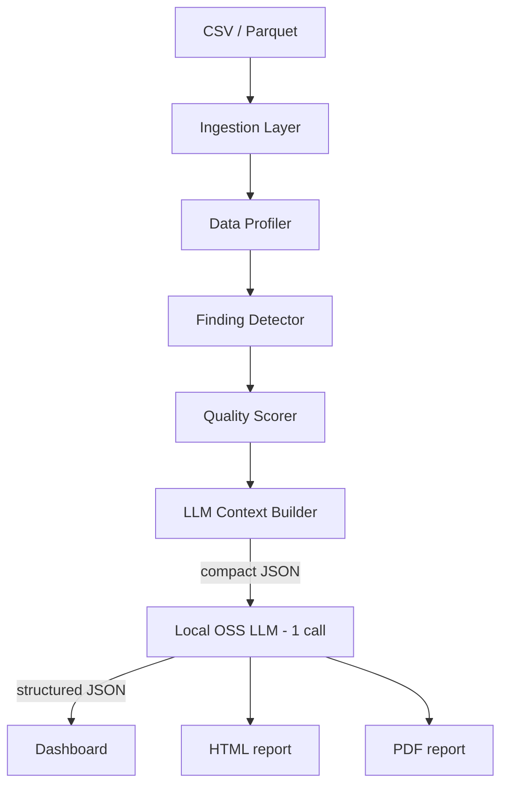

# dq-eda-copilot

Deterministic data-quality profiling for CSV and Parquet datasets, with optional local LLM-assisted interpretation.

## Overview

`dq-eda-copilot` is a web application that analyzes tabular datasets and returns:

- a deterministic data-quality profile
- a deterministic heuristic quality score and status
- a ranked list of findings
- a concise natural-language interpretation
- a downloadable HTML report

The project is designed to be practical, stable, and inexpensive to run. In public deployments, it uses a deterministic fallback interpretation mode to avoid dependence on paid model APIs. In local developer mode, it supports exactly one call to a locally hosted open-source model through Ollama.

## Features

- Upload and analyze **CSV** and **Parquet** datasets
- Deterministic profiling of dataset structure and quality signals
- Heuristic quality scoring with status classification
- Ranked findings for the most important issues
- Concise interpretation suitable for quick review
- Downloadable HTML report
- Free and stable public demo mode using fallback interpretation
- Local OSS model support through **Ollama**
- Request-level tracking for operational visibility

## Demo Modes

### Public Fallback Mode

This mode is intended for free, stable public deployment.

Characteristics:

- no paid LLM dependency
- deterministic interpretation output
- predictable behavior across requests
- suitable for GitHub Pages + Render deployment

In this mode, interpretation is generated by deterministic fallback logic rather than a live model call.

### Local Ollama Mode

This mode is intended for local development and experimentation.

Characteristics:

- uses exactly **one** call to a locally hosted OSS model
- runs through **Ollama**
- preserves deterministic profiling and scoring
- adds structured model-assisted interpretation/report generation

## Architecture



## Processing Flow

1. A user uploads a CSV or Parquet dataset.
2. The ingestion layer validates and loads the file.
3. The profiler computes deterministic quality and profiling metrics.
4. Findings are detected and ranked.
5. A heuristic quality score and status are assigned.
6. A compact context payload is built for interpretation.
7. Either:
   - deterministic fallback interpretation is returned, or
   - one local Ollama model call is made
8. Results are rendered in the dashboard and report outputs.

## Local Setup

### Requirements

- Python environment
- project dependencies installed from `requirements.txt`

### Install

```bash
pip install -r requirements.txt
```

### Run the API

```bash
python -m uvicorn app.api.main:app --reload
```

### Local Endpoints

- API docs: `http://127.0.0.1:8000/docs`
- Health: `http://127.0.0.1:8000/health`

## LLM Configuration Modes

### Fallback Mode

Use deterministic interpretation only.

```yaml
llm_enabled: true
llm_mode: fallback
```

Recommended for:

- public demos
- free deployments
- stable behavior without local model dependencies

### Ollama Mode

Use one local OSS model call through Ollama.

```yaml
llm_enabled: true
llm_mode: ollama
llm_model_name: llama3.2:1b
llm_base_url: http://localhost:11434
```

Recommended for:

- local development
- experimentation with model-based interpretation
- offline or self-hosted workflows

## Run with Ollama Locally

1. Install Ollama.
2. Pull the model:

```bash
ollama pull llama3.2:1b
```

3. Verify Ollama is running:

```bash
curl http://localhost:11434/api/tags
```

4. Update the application configuration:

```yaml
llm_enabled: true
llm_mode: ollama
llm_model_name: llama3.2:1b
llm_base_url: http://localhost:11434
```

5. Start the API:

```bash
python -m uvicorn app.api.main:app --reload
```

6. Open the docs and test the workflow:
- `http://127.0.0.1:8000/docs`

7. Inspect the response fields related to interpretation, especially:
- `llm_report`
- `llm_execution`

## Public Deployment

Recommended deployment model:

- **Frontend:** GitHub Pages
- **Backend:** Render
- **Interpretation mode:** fallback

This setup keeps the public experience free, deterministic, and operationally simple.

## Request Tracking

The application tracks key request metadata for visibility and debugging.

Tracked fields include:

- filename
- file format
- dataset shape
- quality score
- number of findings
- LLM mode
- fallback usage
- model call count

This supports lightweight monitoring without introducing heavy infrastructure.

## Example Datasets

Useful sample datasets for testing include:

- mostly clean customer data
- messy customer data with missing values and duplicates
- wider business or order datasets with mixed field types

These examples help validate both straightforward and problematic quality scenarios.

## Outputs

Typical outputs include:

- dataset profile summary
- quality score and status
- ranked findings
- natural-language interpretation
- HTML report download

Optional PDF-oriented flow is represented in the architecture, with HTML reporting as the primary practical output.

## Future Improvements

- frontend dashboard refinements
- optional PDF export
- richer report styling
- configurable thresholds
- lightweight admin metrics page
- more robust local model output handling

## Project Goal

The goal of `dq-eda-copilot` is to combine deterministic data-quality analysis with lightweight, controlled interpretation so users can get clear, useful feedback on tabular datasets without requiring expensive hosted AI infrastructure.
